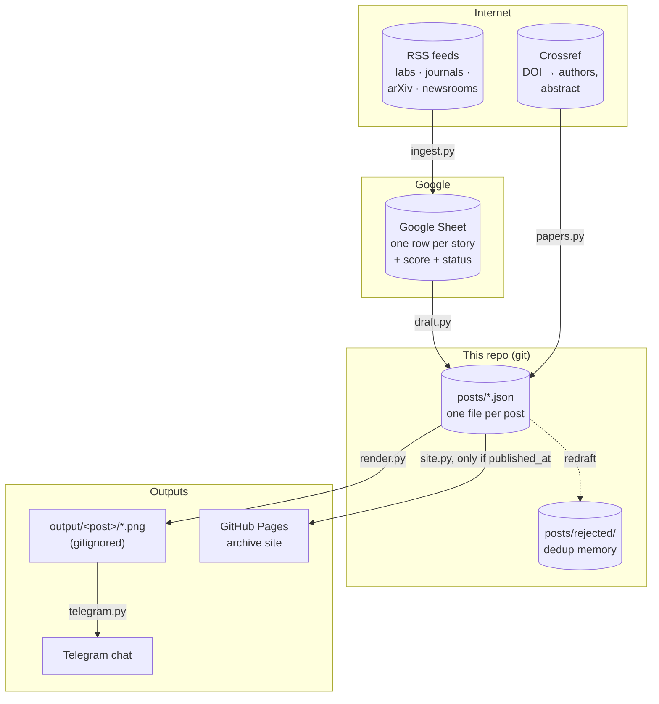
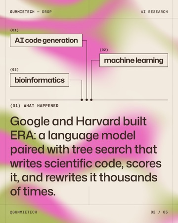
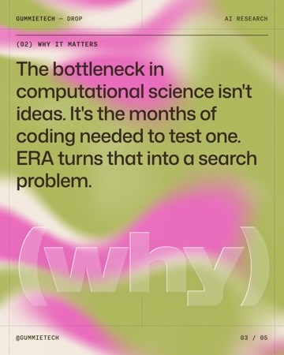
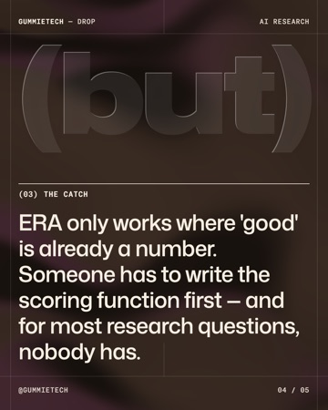
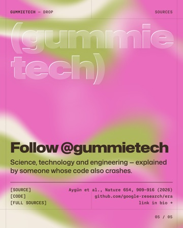
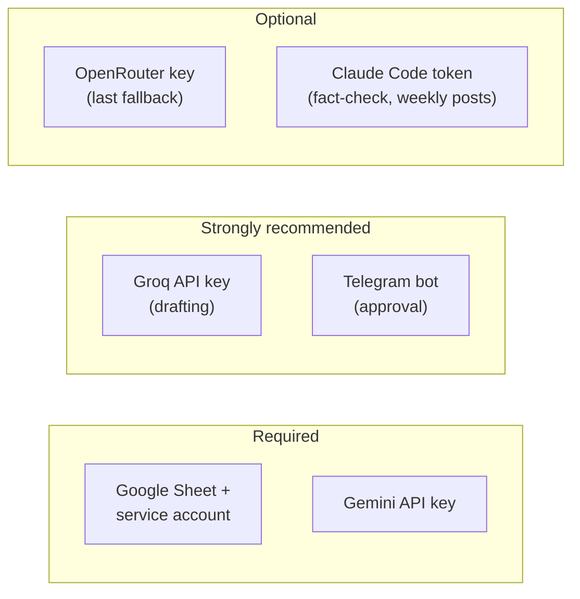
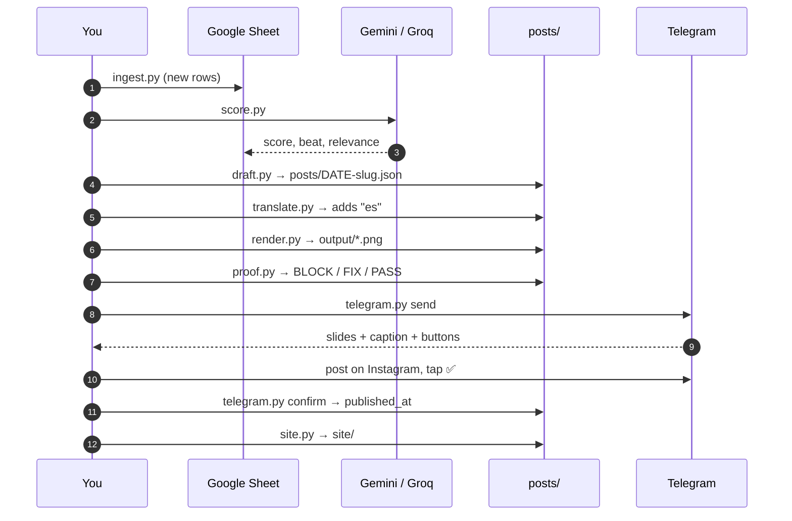
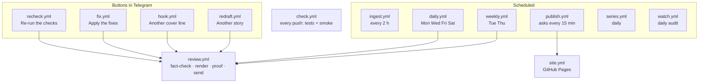
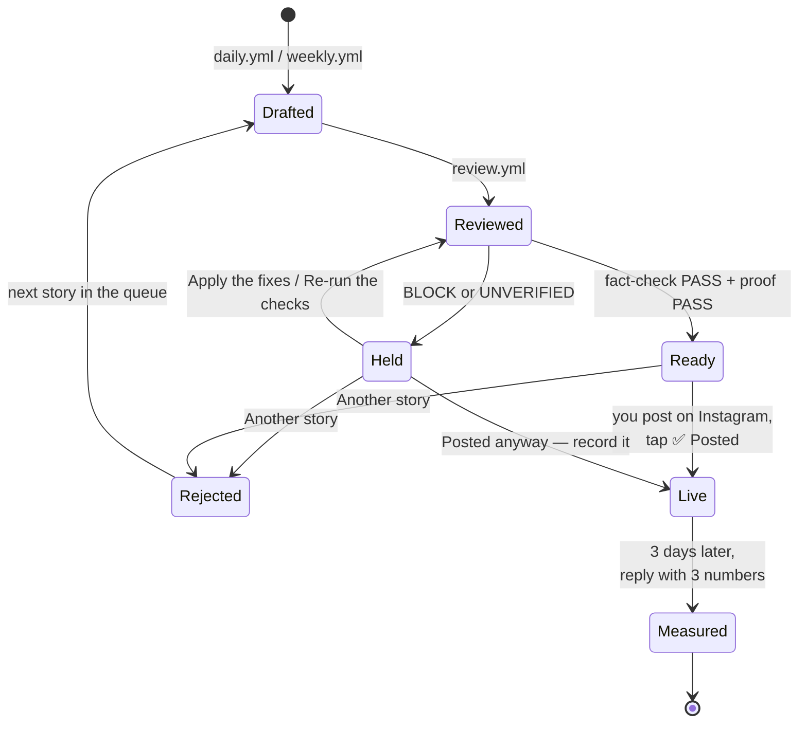

# gummietech

An automated content pipeline for **[@gummietech](https://www.instagram.com/gummietech/)**, an
Instagram account publishing science, technology and engineering posts.

It reads ~70 RSS feeds, has a free LLM score every story, drafts the best one
as structured JSON, fact-checks it against the original paper, renders it to
1080×1350 slides, and sends them to your phone for approval. **A person
always posts the carousel by hand** — the pipeline never publishes on its own.

- **Cost:** $0/month. Every piece is a free tier, open source, or GitHub's own.
- **Archive:** <https://kemval.github.io/gummietechContent/> — the bio link.
- **Deep reference:** `CLAUDE.md` (the rules), `docs/decisions/` (why each rule
  exists), `docs/gummietech_content_system.md` (what gets posted and why).

---

## Contents

1. [How it works](#how-it-works)
2. [The weekly calendar](#the-weekly-calendar)
3. [Post formats](#post-formats)
4. [What a post looks like as data](#what-a-post-looks-like-as-data)
5. [Repository map](#repository-map)
6. [Quick start — run it locally in 10 minutes](#quick-start--run-it-locally-in-10-minutes)
7. [Full setup — every service, step by step](#full-setup--every-service-step-by-step)
8. [Running each stage by hand](#running-each-stage-by-hand)
9. [Running it on GitHub Actions](#running-it-on-github-actions)
10. [The approval loop on your phone](#the-approval-loop-on-your-phone)
11. [Measuring what works](#measuring-what-works)
12. [Tests and CI](#tests-and-ci)
13. [Troubleshooting](#troubleshooting)
14. [Free-tier limits to know about](#free-tier-limits-to-know-about)

---

## How it works

Nine stages. Seven are code; one is a Claude agent; one is you.

```mermaid
flowchart LR
    A["1 · INGEST<br/>RSS feeds<br/>every 2 h"] --> B["2 · SCORE<br/>Gemini Flash Lite<br/>batched 15–20"]
    B --> C["3 · DRAFT<br/>paper-first<br/>strict JSON"]
    C --> D["3b · FACT-CHECK<br/>Claude agent<br/>vs. the source"]
    D --> E["4 · RENDER<br/>HTML → PNG<br/>Playwright"]
    E --> F["4b · PROOF<br/>measures the<br/>layout"]
    F --> G{{"5 · HUMAN GATE<br/>Telegram<br/>(you)"}}
    G -->|you post it| H["6 · PUBLISH<br/>Meta Business Suite<br/>by hand"]
    H --> I["7 · LEARN<br/>saves · shares ·<br/>profile visits"]

    style G fill:#EE6EC0,stroke:#3B2C23,color:#3B2C23
    style H fill:#F7EFE2,stroke:#3B2C23,color:#3B2C23
```



| Stage | What happens | Code | Runs on |
|---|---|---|---|
| **1 Ingest** | Fetch every feed in `feeds/*.yaml` (browser User-Agent), skip URLs already seen, append new rows to a Google Sheet | `src/ingest.py` | `ingest.yml`, every 2 h |
| **2 Score** | A keyword pre-filter, then the LLM scores each item on four axes plus `relevance`, and names its `beat` | `src/score.py` | same job |
| **3 Draft** | Pick the best fresh row (≤ 10 days old, tech beats first), find the paper's DOI, pull authors + abstract from Crossref, write the post JSON | `src/draft.py`, `src/papers.py` | `daily.yml` Mon/Wed/Fri/Sat |
| **3b Fact-check** | A read-only Claude agent checks every claim, number, author and the preprint flag against the source | `.claude/agents/fact-check.md` | `review.yml` |
| **4 Render** | Jinja2 template → Chromium → one PNG (and an 8 s MP4 backdrop) per slide | `src/render.py` | `review.yml` |
| **4b Proof** | Measures the live page: text past the frame, collisions, contrast < 4.5:1, missing preprint flag, colour repeats | `src/proof.py` | `review.yml` |
| **5 Human gate** | Slides + caption arrive on Telegram with buttons; a failed check withholds the green one | `src/telegram.py` | you |
| **6 Publish** | You upload the carousel in Meta Business Suite and tap **Posted** — the bot stamps `published_at` and rebuilds the archive | `publish.yml`, `src/site.py` | you + the bot |
| **7 Learn** | Three days later the bot asks for saves / shares / profile visits; `learn.py` reports medians | `src/learn.py` | `publish.yml` |

### Where the data lives



**Two facts that save debugging time:**

- The Sheet is the **queue and the dedup memory**. It grows forever on purpose —
  do not delete rows (`docs/decisions/sheet-growth.md`).
- A post appears on the archive **only** once it has `published_at`, and only
  the publish tap adds that. Drafts never leak to the web.

---

## The weekly calendar

Every slot is a GitHub Actions cron. Crons on the free tier run **late (often
3–6 hours)** and sometimes not at all, so each drafting workflow fires four
times a day and the extra firings do nothing once the day's post exists.

| Day | Post | Written by |
|---|---|---|
| Mon | **Drop** | `draft.py` (free LLM) |
| Tue | **Term** — one glossary word | Claude, in `weekly.yml` |
| Wed | **Run** — a Drop plus a code slide, when the paper links a repo | `draft.py --run` (falls back to a plain Drop) |
| Thu | **Breakdown** — explains a published Drop in depth | Claude, in `weekly.yml` |
| Fri | **Drop** | `draft.py` |
| Sat | **Signal** — five stories, one slide each | `draft.py --signal` |
| Daily | **Status report** — a single humour slide | designed by hand, sent by `series.yml` |

---

## Post formats

`src/formats.py` is the one table describing every format; every other module
asks it instead of comparing `post_type` strings.

| `post_type` | Slides | Template | What it's for |
|---|---|---|---|
| `drop` | 5 | `templates/drop.html` | One new result: hook → what happened → why it matters → the catch → follow |
| `run` | Drop + 1 | `templates/run.html` | A Drop + a "try it" slide from the repo's README |
| `breakdown` | 8–10 | `templates/breakdown.html` | How it works, step by step, for a Drop already published |
| `term` | — | `templates/term.html` | A glossary word with an example from a published post |
| `sheet` | — | `templates/sheet.html` | A cheat sheet of `"Term: line"` strings, by hand |
| `signal` | 7 | `templates/signal.html` | Weekly roundup — five stories, each with its own credit |

### The Drop, slide by slide

A real one — the CI fixture `posts/era.json`, rendered by `src/render.py`.
The colour rhythm is fixed: `lead · cream · support · dark · lead`.

<table><tr><td></td><td></td><td></td><td></td><td></td></tr><tr><td align="center"><sub>1 · hook<br>lead</sub></td><td align="center"><sub>2 · what happened<br>cream</sub></td><td align="center"><sub>3 · why it matters<br>support</sub></td><td align="center"><sub>4 · the catch<br>dark</sub></td><td align="center"><sub>5 · follow + credit<br>lead</sub></td></tr></table>

<sub>Regenerate after a design change: `python src/render.py posts/era.json --no-motion`,
then resize `output/era/slide-*.png` to 360 px wide as JPEG into `assets/readme/`
(macOS: `sips -s format jpeg --resampleWidth 360 slide-1.png --out drop-1.jpg`).</sub>

The lead/support pair comes from the topic's **colorway** (`COLORWAYS` in `src/render.py`):

| Colorway | Topics | Lead | Support |
|---|---|---|---|
| `signal` | AI, computing, software, robotics | pink `#EE6EC0` | olive `#B2BC5F` |
| `orbit` | space, astronomy, physics | sky `#7FB2E5` | pink `#EE6EC0` |
| `bloom` | biology, medicine, climate, ecology | olive `#B2BC5F` | blush `#F9A8D4` |
| `ember` | energy, materials, engineering, chemistry | blush `#F9A8D4` | amber `#F2B441` |

No two posts in a row share a field colour; `render.vary()` rotates it if they would.

---

## What a post looks like as data

Every post is one JSON file in `posts/`, named `YYYY-MM-DD-<slug>.json`. A Drop:

```json
{
  "post_type": "drop",
  "domain": "AI research",
  "colorway": "signal",
  "hook": "A robot learned to fold laundry from 30 demos",
  "what_happened": "…",
  "why_it_matters": "…",
  "the_catch": "…",
  "caption": "…",
  "keywords": ["…"],
  "hashtags": ["#…"],
  "alt_text": "…",
  "source_url": "https://…",
  "attribution": "Smith et al., Science Robotics",
  "peer_reviewed": true
}
```

Fields the pipeline adds later, never the model: `hooks` (alternate covers),
`beat`, `doi`, `code_url`, `es` (Spanish, from `translate.py`), `published_at`
(the publish tap), `metrics` (your three numbers). The full contract is in
`CLAUDE.md` → *Drafting output contract*.

`posts/era.json`, `era-breakdown.json` and `era-signal.json` are **test
fixtures** — undated, never published, rendered by CI on every push. They are
also the easiest thing to render while you learn the pipeline.

---

## Repository map

```
gummietech/
├── feeds/                 RSS sources, one YAML file per tier
│   ├── tier1_primary.yaml     51 labs, agencies, newsrooms, journals
│   ├── tier2_preprints.yaml   13 arXiv / bioRxiv categories
│   ├── tier3_signal.yaml       2 where stories get reacted to
│   └── tier5_depth.yaml        2 weekly single-topic essays
├── src/                   the pipeline (Python 3.12, one stage per file)
│   ├── ingest.py  score.py  draft.py  papers.py     stages 1–3
│   ├── render.py  proof.py  reel.py   build_kit.py  stage 4
│   ├── telegram.py  site.py  translate.py           stages 5–6
│   ├── learn.py  watch.py                           stage 7 + audit
│   ├── llm.py  gemini.py  groq_llm.py  openrouter_llm.py   LLM backends
│   └── formats.py  wording.py  hook.py  weekly.py  series.py  verify_feeds.py
├── templates/             Jinja2 HTML + CSS for slides, reel and archive
│   └── tokens.css             the locked palette and fonts — don't edit
├── posts/                 one JSON per post (the real database of record)
│   └── rejected/              drafts turned down — kept for dedup
├── series/                the daily status-report slides
├── tests/                 pytest — each test is a past bug
├── docs/                  strategy, voice, and docs/decisions/ (the "why")
├── .claude/agents/        fact-check · slide-proof · feed-scout · evergreen-scout
├── .github/workflows/     every scheduled and button-triggered job
├── output/                rendered PNG/MP4 (gitignored)
└── site/                  built archive (gitignored)
```

---

## Quick start — run it locally in 10 minutes

This renders and proofs a post **with no accounts and no API keys**. Do this
first: if it works, your machine is set up correctly.

**You need:** Python **3.12**, git, and ~500 MB of disk for Chromium.
`ffmpeg` is only needed for reels.

```bash
# 1. Get the code
git clone https://github.com/kemval/gummietechContent.git gummietech
cd gummietech

# 2. Create an isolated Python environment
python3.12 -m venv venv
source venv/bin/activate              # Windows: venv\Scripts\activate

# 3. Install the Python packages
pip install -r requirements-dev.txt   # runtime packages + pytest

# 4. Install the headless browser Playwright renders with
python -m playwright install chromium
#    (Linux only: python -m playwright install --with-deps chromium)

# 5. Render the sample Drop to PNG
python src/render.py posts/era.json --no-motion
#    → writes output/era/*.png — open them to look

# 6. Measure the layout (exits 1 if anything is BLOCK)
python src/proof.py posts/era.json

# 7. Run the test suite (offline, a few seconds)
python -m pytest

# 8. Build the web archive and open it
python src/site.py
open site/index.html                  # Windows: start site\index.html
```

✅ If all eight steps succeed, everything from **render** onward works on your
machine. The stages before it (ingest, score, draft) need the accounts below.

---

## Full setup — every service, step by step

All five services are free. You need the first two to run the pipeline at all;
the rest switch on extra stages.



### Step 1 — Create your `.env`

```bash
cp .env.example .env
```

`.env` and `credentials.json` are gitignored. **Never commit them.**

### Step 2 — Google Sheet (the queue)

1. Go to [Google Cloud Console](https://console.cloud.google.com/) → create a
   project (any name).
2. **APIs & Services → Library** → enable **Google Sheets API**.
3. **IAM & Admin → Service Accounts → Create service account**. No roles needed.
4. Open the account → **Keys → Add key → JSON**. Save the file as
   `credentials.json` in the repo root.
5. Create an empty Google Sheet. Copy its ID from the URL:
   `https://docs.google.com/spreadsheets/d/`**`<THIS PART>`**`/edit`
6. **Share** the Sheet with the service account's `client_email` (inside
   `credentials.json`) as **Editor**.
7. In `.env`:
   ```ini
   GOOGLE_SHEETS_CREDENTIALS=credentials.json
   GOOGLE_SHEET_ID=<the ID from step 5>
   ```

You don't create any columns — `ingest.py` writes the header row itself.

### Step 3 — Gemini (scoring)

1. Get a key at <https://aistudio.google.com/apikey>.
2. In `.env`:
   ```ini
   GEMINI_API_KEY=<your key>
   GEMINI_MODEL=gemini-3.5-flash-lite
   ```

> ⚠️ **Set `GEMINI_MODEL` to Flash Lite.** The code's default is Gemini 3.5
> Flash, whose free tier allows only **20 requests a day** — one scoring pass
> needs 40–80. Flash Lite allows 500. CI already pins this in `ingest.yml`.

### Step 4 — Groq (drafting and translation)

1. Get a key at <https://console.groq.com/keys>.
2. In `.env`:
   ```ini
   LLM_PROVIDER=groq
   GROQ_API_KEY=<your key>
   ```

`LLM_PROVIDER` picks the backend for drafting and translation. If a provider
is overloaded (5xx), the run fails over down `llm.FALLBACK_ORDER`; a bad key or
a spent daily cap still stops it.

### Step 5 — OpenRouter (optional last fallback)

1. Get a key at <https://openrouter.ai/keys>. **Do not add credit.**
2. In `.env`:
   ```ini
   OPENROUTER_API_KEY=<your key>
   ```

Only `:free` model ids are accepted — the code refuses anything else. A `503`
from OpenRouter usually means the account's privacy setting blocks free models.

### Step 6 — Telegram (the approval gate)

1. In Telegram, message **@BotFather** → `/newbot` → keep the token.
2. Send your new bot any message.
3. Open `https://api.telegram.org/bot<TOKEN>/getUpdates` in a browser and copy
   `result[0].message.chat.id`.
4. In `.env`:
   ```ini
   TELEGRAM_BOT_TOKEN=<token>
   TELEGRAM_CHAT_ID=<chat id>
   PUBLISH_TZ=America/Bogota      # so published_at uses your date, not UTC
   ```

### Step 7 — Claude Code (optional: fact-check and weekly posts)

Fact-checking and Tuesday/Thursday posts run Claude Code in CI on your **Pro
subscription**, not API billing:

```bash
claude setup-token          # prints a token
```

Add it as the GitHub secret `CLAUDE_CODE_OAUTH_TOKEN` (see below). Without it,
the fact-check is skipped and the Telegram message **says so** — the post is
marked `UNVERIFIED` rather than silently passed.

### Step 8 — Check it all

```bash
python src/verify_feeds.py        # are the feeds alive? (-v for every URL)
python src/ingest.py --dry-run    # fetch feeds, print, write nothing
python src/score.py --dry-run --limit 20
```

---

## Running each stage by hand

Run these in order from the repo root with `venv` active. Every script has
`--help`.



```bash
# 1 · Ingest — fetch all feeds into the Sheet
python src/ingest.py                         # --file feeds/tier1_primary.yaml for one tier

# 2 · Score — rate unscored rows
python src/score.py                          # --limit N, --dry-run

# 3 · Draft — write the best fresh story as JSON
python src/draft.py                          # prints the new file's path
python src/draft.py --run                    # Wednesday: prefer a story with code
python src/draft.py --signal                 # Saturday: five-story roundup
python src/draft.py --row 42                 # this Sheet row, ignoring freshness
python src/draft.py --url https://…          # any page, bypassing the Sheet
python src/draft.py --dry-run                # show the pick, write nothing

# 3a · Spanish for the archive
python src/translate.py posts/2026-10-09-example.json

# 3b · Fact-check (inside Claude Code, in this repo)
#      > run the fact-check agent on posts/2026-10-09-example.json

# 4 · Render (add --colorway orbit to override the colour)
python src/render.py posts/2026-10-09-example.json

# 4b · Proof
python src/proof.py posts/2026-10-09-example.json

# 5 · Send to your phone, then record the tap
python src/telegram.py send posts/2026-10-09-example.json
python src/telegram.py confirm

# 6 · Rebuild the archive
python src/site.py
```

Other useful commands:

| Command | What it does |
|---|---|
| `python src/hook.py <post> 2` | Swap the cover line for alternate hook #2 |
| `python src/reel.py <post>` | Turn a published Drop into a silent 9:16 MP4 (needs `ffmpeg`) |
| `python src/learn.py` | Metrics report — what to cut, what to double |
| `python src/watch.py` | Audit: what should have happened and didn't |
| `python src/series.py` | Print the status-report queue |
| `python src/translate.py --check` | Fail if any post's Spanish is stale |

---

## Running it on GitHub Actions

This is how the pipeline runs day to day. Fork or push the repo, then:

### 1. Add the secrets

**Settings → Secrets and variables → Actions → New repository secret**

| Secret | Value | Needed by |
|---|---|---|
| `GOOGLE_SHEETS_CREDENTIALS_JSON` | the **entire contents** of `credentials.json` | ingest, draft |
| `GOOGLE_SHEET_ID` | the Sheet ID | ingest, draft |
| `GEMINI_API_KEY` | Gemini key | scoring |
| `GROQ_API_KEY` | Groq key | drafting, translation |
| `OPENROUTER_API_KEY` | OpenRouter key *(optional)* | last fallback |
| `TELEGRAM_BOT_TOKEN` | bot token | gate, alerts |
| `TELEGRAM_CHAT_ID` | chat id | gate, alerts |
| `CLAUDE_CODE_OAUTH_TOKEN` | from `claude setup-token` *(optional)* | fact-check, Tue/Thu posts |

**Variables tab** (not secrets):

| Variable | Example | Purpose |
|---|---|---|
| `LLM_PROVIDER` | `groq` | backend for drafting |
| `PUBLISH_TZ` | `America/Bogota` | date `published_at` in your zone |
| `GROQ_MODEL`, `OPENROUTER_MODEL` | *(leave unset)* | override the default model |

### 2. Turn on GitHub Pages

**Settings → Pages → Source: GitHub Actions.** `site.yml` deploys the archive
on every push to `master` that touches posts or templates.

### 3. Allow the bot to commit

**Settings → Actions → General → Workflow permissions → Read and write.**
Drafts and `published_at` are committed by the workflows themselves.

### 4. Try it once by hand

**Actions → ingest → Run workflow**, wait for green, then
**Actions → daily → Run workflow** with **force** ticked. Within a few minutes
the slides should arrive on Telegram.

### The workflows



Any failed scheduled run posts its URL to Telegram (`.github/actions/notify-failure`).

---

## The approval loop on your phone



What you do, in order:

1. A Telegram message arrives with the slides **as files** (full quality) and
   `caption.txt`.
2. Read the fact-check and proof verdicts at the top. If either says **BLOCK**
   or **UNVERIFIED**, the green button is hidden — fix it or pick another story.
3. Download the slides, upload them as a carousel in **Meta Business Suite**,
   paste the caption, publish (or schedule).
4. Tap **✅ Posted to Instagram**. `publish.yml` records it on its next poll —
   **allow up to a couple of hours**, the free cron is slow — then commits
   `published_at` and rebuilds the archive.
5. Three days later the bot asks for numbers. **Reply to that message** with
   three integers: `saves shares profile_visits`, e.g. `41 12 9`.

---

## Measuring what works

```bash
python src/learn.py                 # medians by format, colorway, domain, weekday
python src/learn.py --by beat       # group by any field
```

Saves and shares are the growth metrics; profile visits the funnel one. Likes
are deliberately not tracked. Groups under three posts are held back, and the
"cut the weakest format" decision waits for thirty measured posts.

---

## Tests and CI

```bash
python -m pytest                    # offline: no network, no LLM, no browser
```

Every test is a bug this repo already shipped once — that is the bar for
adding one. `check.yml` runs on every push and PR:

| Job | Checks |
|---|---|
| `smoke` | every module imports; render + proof every fixture; render a reel; build the archive; no stale Spanish |
| `tests` | pytest |
| `publish-deps` | `telegram.py` loads with only `requests` + `python-dotenv` |
| `workflows` | actionlint + shellcheck over every workflow |

Merge a PR only on a green `check.yml`. Green means "nothing obvious", not "safe".

---

## Troubleshooting

| Symptom | Cause | Fix |
|---|---|---|
| `GOOGLE_SHEET_ID is not set` | `.env` missing or not filled | Step 1–2 above |
| `The service account cannot open this sheet` | Sheet not shared | Share it with `client_email` as **Editor** |
| `Google rejected the request` | Sheets API off | Enable Google Sheets API in the service account's project |
| `429` / daily cap on scoring | Using Gemini Flash (20/day) | Set `GEMINI_MODEL=gemini-3.5-flash-lite` |
| Feed shows `not well-formed` | Cloudflare block page, not XML | Usually transient; run `verify_feeds.py -v`, ask the `feed-scout` agent if it persists |
| arXiv feeds show 0 entries | It's the weekend | Nothing is announced Sat/Sun — expected |
| `draft.py` picks nothing | Every queued row is > 10 days old | Run ingest + score, or `--row N` to force one |
| `Executable doesn't exist` from Playwright | Chromium not installed | `python -m playwright install chromium` |
| `proof.py` reports BLOCK on the catch | Paper states no limitation, `the_catch` is `""` | Expected — the fact-check supplies one; **Apply the fixes** writes it in |
| Tapped ✅ but nothing happened | `publish.yml` hasn't run yet | Wait; or **Actions → publish → Run workflow** |
| Post not on the archive | No `published_at` | Only the publish tap adds it — by design |
| Telegram message says checks were skipped | No `CLAUDE_CODE_OAUTH_TOKEN` | Step 7 above |

For anything else: `python src/watch.py` lists what should have happened and
didn't, and `docs/decisions/` explains the reasoning behind each rule.

---

## Free-tier limits to know about

| Service | Limit | How the pipeline copes |
|---|---|---|
| Gemini 3.5 Flash Lite | 500 requests/day, plus a per-minute cap | Batches 15–20 items per call, keyword pre-filter, backs off on 429 |
| Groq | per-minute token cap (~8k for the drafting model) | Paper excerpts are trimmed to fit |
| OpenRouter `:free` | 50 requests/day | Always last in the fallback order |
| GitHub Actions cron | runs late (3–6 h) and drops runs | Every workflow fires several times and gates extras to no-ops |
| Instagram | no free scheduling API worth the review | Posting stays manual via Meta Business Suite |

**Budget rule:** $0/month. Do not add a paid service. Claude Code usage (your
Pro plan) and the pipeline's runtime LLM calls (Gemini/Groq free tiers) are
separate budgets — never point scoring at a paid API.
